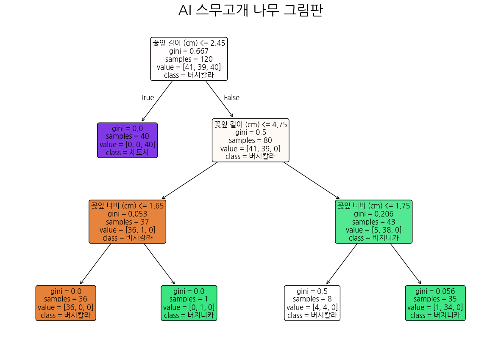

# 🌸 AI 바이브 코딩: 스무고개 로봇과 아이리스 꽃 분류하기 🤖

## 🎯 프로젝트 목적

본 프로젝트는 **초등학생 대상 AI 코딩 교육 (AI 바이브 코딩)**을 위해 만들어진 재미있는 실습 자료입니다.
아이들이 파이썬 기반 데이터 분석과 인공지능(AI) 모델의 원리를 쉽고 친근하게 경험해보는 것을 목표로 합니다.

최종적으로는 AI가 학습을 마친 결과를 시각화된 나무 그림으로 뽑아보고, 그 결과를 바탕으로 **"내가 직접 결정트리를 활용해 다양한 꽃을 분류하는 숙제/보고서"**를 완성해 보는 똑똑한 체험을 다룹니다! 🎒✨

---

## 🌳 의사결정나무(Decision Tree) 로봇이란 무엇일까요?

인공지능 로봇 이름이 어떻게 '나무(Tree)'일 수 있을까요? 아주 쉽고 재미있는 비밀이 숨어있답니다!

1. **스무고개 게임하기:**
   우리가 친구와 스무고개 놀이를 할 때 "다리가 4개니?", "날개가 있니?" 하고 계속 질문하면서 정답을 좁혀 나가죠?
2. **AI의 질문 파티:**
   의사결정나무 인공지능도 똑같습니다! 로봇은 꽃들의 '길이'나 '너비' 같은 숫자 표를 보고 스스로 규칙을 만듭니다.
   > *"혹시 꽃잎 길이가 2.45cm보다 작나요?"*
   > *"이번엔 꽃잎 너비가 1.65cm보다 작나요?"*
   > 이렇게요!
   >
3. **가지를 쭉쭉 뻗어가는 나무:**
   질문에 "네!" 또는 "아니오!"라고 대답할 때마다 길이 계속 두 갈래로 나뉩니다. 이 질문의 길을 계속 따라가다 보면 어느새 정답(예: 귀여운 세토사 꽃!)에 도착하게 되는데, 이 모습이 **질문이 나뭇가지처럼 주렁주렁 열린 나무 모양**과 똑같아서 **의사결정나무"**라고 부른답니다!

가장 큰 장점은, 로봇 속 머리가 어떻게 돌아가는지 우리가 **'나무 그림판'**을 통해 직접 눈으로 훤히 들여다보고 쉽게 이해할 수 있다는 점이에요!

---

## 📂 파일 설명 (무엇을 가지고 공부하나요?)

- **`main.ipynb`**: 파이썬 코드를 한 줄씩 실행해보며 꽃 데이터를 로봇에게 훈련시키는 **실습용 연습장**입니다. 쉬운 용어와 재미있는 이모지가 듬뿍 들어있어요!
- **`꽃데이터.xlsx`**: 선생님이 주신 150송이 아이리스 꽃 특징 정보가 모두 담긴 엑셀 **데이터 창고**입니다.
- **`아이리스 분석 보고서.docx`**: 실습이 끝난 다음, 로봇이 만든 나무 그림판 결과를 예쁜 표와 함께 정리한 멋진 **보고서(숙제) 완성본**입니다! 직접 확인해 보세요.
- **`결과.png`**: 완성된 ಸ್무고개 나무가 한 폭의 그림으로 찰칵 저장된 그림판 파일입니다!
